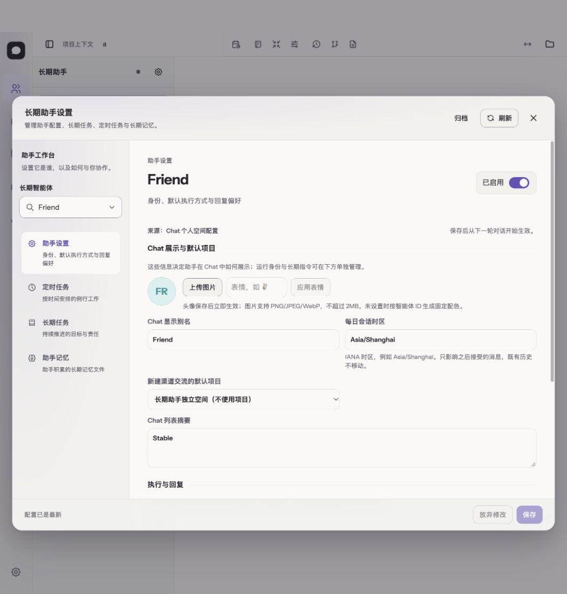
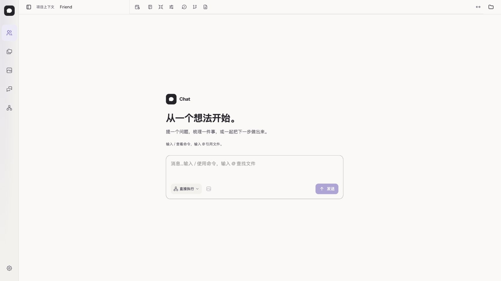

# 助手设置与聊天页：第二轮设计落地

日期：2026-10-01。遵循[前端设计方法](../frontend-design-method.md)。

## 任务与当前证据

用户需要连续查看真实页面。此前浏览器打开了 `file:///…/frontend/index.html`，Vite 源文件不能通过文件地址运行；交付必须打开 HTTP 服务并验证实际内容，不能只提供源码入口。

本轮选择两个相邻场景：管理一个长期助手，以及在会话中提出任务。助手设置保留既有身份、Workflow、任务与记忆服务；聊天页复用原发送与会话读取，不新增执行语义。

## 信息与关系推导

| 场景 / 信息 | 来源、读写及范围 | 关系 → 表达 |
| --- | --- | --- |
| 当前助手及设置分类 | Long Agent 列表；选中态为浏览器临时状态 | 助手 → 设置/定时/长期任务/记忆：导航持续显示对象与分类说明 |
| 展示别名、简介、时区、默认项目 | 配置 API；显式保存、有 revision | 同组编辑字段：清楚的标题与说明、规则对齐、固定保存状态 |
| 默认 Workflow 与节点配置 | 助手 Home 的公共 Workflow API；独立即时保存 | 执行方法 → 节点：摘要展示现有流程，明确入口打开上一轮共用编辑器 |
| 运行身份与长期指令、渠道、装配 | 分别来自 Group/配置/inspection；各自保存或只读 | 低频深入信息：放在相关主字段后，不能压过日常编辑；不合并保存合同 |
| 空白会话 | 公共 Session 已加载且无消息、无运行 | 提示可以开始的任务与输入方法；失败/加载/历史浏览不冒充空态 |
| 消息、输入、工作流、附件、发送 | 既有 ChatWindow/ChatInput 数据与操作 | 写作区与操作区分行：全文输入优先；工作流与附件在左，唯一发送/停止在右 |
| 长对话与恢复 | 原 Pi Session / Hook / 草稿存储 | 保留原消息和过程投影、滚动、草稿、取消与发送时序，只升级表达 |

## 参考、组件与边界

沿用方法文档已核对的 Material 列表—详情与 Apple 内容层级原则；不增加新的组件库。助手设置使用现有 SurfaceDialog、SearchSelect、Button 和 CSS Module；消息页使用共享 Token 与已有控件。纸/玻璃与配色继续独立；正文不叠加透明背景。

助手导航给分类增加简短职责说明，主区按当前分类显示导语；身份字段和执行配置分段，避免嵌套卡片与大折叠行。运行身份与 Chat 别名仍是不同事实，不能仅为整齐而合并。

聊天空态只说明实际可做的事，不制造历史、示例回复或自动发送。输入和工具分行后仍保留所有能力；普通/长期助手共用输入框，Workflow 配置入口遵守原权限。预览使用既有隔离 Backend 和本地假模型。

## 验收与迭代

验证助手保存/刷新、嵌套 Workflow 返回保留草稿、任务与记忆导航；空会话开始输入、发送、完成与刷新、键盘及窄屏；浅/深和纸/玻璃。保存实际截图并记录验证结果。布局改动不能改变业务数据或请求载荷。

### 已实现

- 助手设置增加 4 类职责导航、对象标题与说明、身份字段分段；执行配置直接呈现实际 Workflow 节点顺序并进入公共节点编辑器。
- 普通与长期助手空会话共用欢迎区和两行输入框。输入、工作流、附件与发送仍使用原状态和事件；加载、错误、历史和只读不显示欢迎态。
- 高度不超过 600px 时收起欢迎说明，把有限空间留给输入与发送。此次真实浏览器回归在 390×420 发现操作行底部超出屏幕 20.6px，修复由这个业务可用性门禁看护。
- 纸 / 玻璃、明暗和配色使用全局主题，不写页面私有主题；预览入口为 HTTP 服务。

### 验证证据

- 类型检查通过；前端 282 项、后端 695 项、工具 58 项、构建产物 31 项测试通过。`pnpm verify` 首次在上述新增短窗口场景失败；修复后重建前端并重跑 `pnpm test:dev`，10 通过、0 失败、2 条件跳过，退出码 0。不把分段重跑写成单次全套通过。
- 开发链覆盖 390×844 / 390×420 / 1440×900 空会话输入与完整操作行可见、真实发送后欢迎区退出、Session Memory 开关、工作流完成通知与历史恢复。付费真实模型未启用，Nano 联合渠道因隔离 checkout 缺少其依赖跳过；不宣称这两条外部链路已验收。
- 手动实看助手设置 → 共用 Workflow 节点编辑 → 返回，确认入口与焦点恢复；输入草稿刷新保留，清空后发送禁用。
- 实看浅色纸质、深色玻璃，并确认多个页面同步切换；最终预览恢复浅色纸质。浏览器预览使用独立测试数据。
- 本轮人工没有逐项重新编辑定时任务与记忆内容；这些分类沿用原模块，并由既有自动化回归覆盖。不宣称本轮重做了它们的内部布局。

### 下一轮

先观察用户对这两页的反馈，再逐项改善运行中对话与已完成过程的可读性、助手任务和记忆详情。保持“场景 → 信息 → 关系 → 表达 → 视觉 → 验证”的记录，不因增加皮肤而跳过前面的判断。

## 顶栏收敛：会话名回归修复与图标归组

日期：2026-10-02。最小记录。

- 任务与入口：用户在 Friend（长期助手）会话顶栏看到会话名 `Nexus · Ziji Content Lab · 新会话` 重新出现，且“Project”标签加空的 `workspace-project-slot` 在无选择器内容时仍占 112–240px 空位，侧栏收起开关单独占最左一格。入口：聊天顶栏（桌面与窄屏）。
- 当前问题与证据：未提交改动把 `workspace-conversation-heading` 改为显示 long agent 会话名，违反 [ui-ux-guidelines §18.4/§620](../ui-ux-guidelines.md) 已固化的“Friend 会话顶栏不显示会话名”合同；slot 空置时仍保留 flex 基数形成死区域。
- 信息清单与来源：会话名仅来自 Session 列表事实，顶栏不承载会话身份；项目选择器仍是普通项目会话的顶栏事实源（Portal 到 slot）；侧栏开关是面板控制，不是会话信息。
- 关系推导：会话身份 → 会话列表/历史表达，顶栏只保留按用途命名的动作；无内容的 Portal 宿主 → 不参与布局（`:empty` 收起）；面板开关与其控制的面板同侧 → 侧栏开关固定最左，项目资料开关留在右端。
- 实施映射：`AppShell` 移除独立左区（标签 + 空位）；heading 整体删除——顶栏不显示会话名，也不显示 "Friends" 分区标题，仅保留一个占位符把会话动作推到右侧图标组；`workspace.css` 删除 `.workspace-context-label` 与 `.workspace-conversation-heading` 全部规则，新增 `.workspace-project-slot:empty { display:none }`，分隔线改挂在非空 slot 上。
- 验收：顶栏除功能图标外不显示任何文字标题；普通项目会话顶栏选择器、动作不变；窄屏与桌面、明暗主题下图标排列一致；`pnpm test`、`pnpm typecheck`、`pnpm build` 通过。
- 修订（2026-10-02，用户纠正）：第一版把侧栏开关移到右侧图标组、并为 long agent/同事面板保留 "Friends" 分区标题，均为擅自发挥。用户明确：开关控制左侧列表，必须固定最左；顶栏彻底不显示任何标题文字，未要求的内容不得添加。规范同步见 ui-ux-guidelines §7 与 development.md §页面适配入口。

## LA 项目树：添加项目接通打开/创建

日期：2026-10-02。最小记录。

- 任务与入口：用户在 Friend 项目树点击"＋ 添加项目"时按钮禁用（两个已注册项目都已绑定），且即使可用也只能从已注册列表挑选——无法像 VSCode 打开 workspace、Codex 桌面版打开/创建项目那样从磁盘引入新项目。
- 当前问题与证据：`LongAgentProjectTree` 的 Add 按钮 `disabled={busy || bindable.length === 0}`，全部绑死后成为死端；绑定选择器只列已注册项目。这违反 [LA 项目树评审](../../../docs/history/reviews/2026-10-01-la-project-session-tree.md) 的验收口径："添加项目与现有项目注册流程一致，仅入口移位"——现有注册流程即 `POST /api/projects/open` 按路径登记或初始化。
- 信息与关系：添加 = 先有项目事实（已注册或按路径打开登记），再写 LA 配置 `boundProjectIds`（revision 校验、后端 `resolveProjectContext` 验证可解析）。两条来源（已注册未绑定 / 按路径打开）殊途同归到同一绑定动作。
- 实施：Add 按钮仅 `busy` 时禁用；点击**直接弹出** [DirectoryPicker](../../components/DirectoryPicker.tsx)——复用其底层文件系统能力（后端 `/api/cwd/browse` 列目录，浏览器拿不到绝对路径），选择目录 → `openChatProject` 登记或初始化 → 绑定 → 刷新项目列表 → 选中该项目；打开已注册目录幂等（返回既有项目），无需任何中间层。新增 i18n `laProjectTree.openProject`（随后随中间层一起移除）。
- 修订（2026-10-02，用户两次纠正）：第一版用裸路径输入框，被否决——没有人逐字符输入路径；第二版加"打开项目…"中间按钮和已注册下拉，再被否决——打开项目就是打开一个目录，一步完成，不要两层。最终形态：Add project → 目录点选对话框 → 选完即绑定，单层直达。
- 验收：全部已注册项目绑死后按钮仍可点击；点击 Add project 直接弹出目录点选对话框，可逐级浏览并选择目录登记绑定，名称即时解析；选择非法目录给出错误提示；`pnpm test`、`pnpm typecheck`、`pnpm build` 通过。

## DirectoryPicker 展示修复（弹层内容烂尾迁移）

日期：2026-10-02。最小记录。

- 任务与入口：用户截图显示目录选择对话框条目全部居中悬浮、无行结构、无 hover 形状，判定为不可交付。
- 当前问题与证据：commit `93d460c` 把 DirectoryPicker 迁入 SurfaceDialog 时删除了旧内联样式与 520px 面板 CSS，但替换样式从未补写——TSX 里的 `directory-picker-entry/back/action/footer` 类名在 CSS 中不存在（死类名），共享 Button 的 `justify-content:center` 使每行内容居中，形成"整行宽、内容居中"的幽灵行。属于迁移半途而废，不是新设计。
- 信息与关系：SurfaceDialog 是固定尺寸 flex 列（§20.6 统一弹层，内容单独滚动 §412）；行模式采用既有 `catalog-item` 关系（左对齐、全宽、hover 背景、圆角 Token）；宽幅弹层用 auto-fill 网格填充，不留死空间。
- 实施：重排内容为 nav（返回/路径/转到）+ 可滚列表（flex:1）+ footer 三段，全部成为弹层 flex 列的直接子级；在 `components.css` 补写 `.directory-picker-*` 全套样式（条目左对齐 mono、网格填充、hover、44px Compact 规则、footer 安全区）；错误提示移到 footer 上方常驻可见。
- 验收：条目左对齐成行、hover 有形、列表独立滚动、宽幅下网格填充无空洞；`pnpm test`、`pnpm typecheck`、`pnpm build` 通过并回写浏览器实测截图。

## Friends 面板头部移除：网关状态与设置入口上顶栏

日期：2026-10-05。最小记录。

- 任务与入口：用户要求删除 Friends 侧栏面板的整个头部（"Friends" 标题、网关绿点、设置齿轮），齿轮移到顶栏。入口：左侧 Friends 面板 + 顶栏（桌面与窄屏）。
- 当前问题与证据：面板头部在 224px 栏内占一行，绿点是裸圆点、含义不可读（截断成 "Gateway c…" 更糟）；齿轮与标题把面板高度花在非列表内容上。
- 信息与关系：头部绿点与头像右下角绿点不是同一层——头部是 NanoClaw 网关（常驻门卫进程）健康检查，整个列表共用一盏（所有 Friend 默认共享一个 Host 实例）；头像点是单个 Agent 的 presence（就绪/工作中）。两层独立是刻意设计：网关挂了网页照常可用，只有 IM 断，bridge.ts 注释明确 channel health 不得影响 Web 可用性。用户拍板：网关状态保留但移到顶栏，且不得用裸圆点表达。
- 关系推导：网关健康 = 基础设施层状态 → 顶栏用「图标 + 文字」chip 表达（绿 = 已连接，红 = 未连接），tooltip 保留完整含义句（"不代表消息渠道已连接"）；设置齿轮 = 面板动作 → 与其控制的面板同侧（顶栏左侧、列表开关旁），沿用 Portal slot 惯例；面板不可见或 slot 为空 → `:empty` 收起不留空位。
- 实施映射：`ProjectLongAgentSection` 删除整个 header 与 `.hostOnline/.hostOffline/.headerAction` 样式；新增 `toolbarSlot` prop，网关 chip（`IconPlugConnected` + `sidebar.longAgentImOnline/Offline` 文案）与齿轮（改用统一 `ToolbarAction`）通过 `createPortal` 渲染进顶栏 `workspace-la-tools-slot`；`AppShell` 新增 slot state 并经 `SessionSidebar` 透传。空 Agent 列表时 chip 不渲染、齿轮禁用（与原行为一致）。
- 验收：Friends 面板无头部行，列表直接从面板顶部开始；仅 Friends 面板可见时顶栏出现 chip 与齿轮，切回普通会话列表则收起；网关未连接时 chip 变红并给出完整 tooltip；窄屏与桌面、明暗主题下排列正常；`pnpm test`、`pnpm typecheck`、`pnpm build` 通过。
- 修订（2026-10-05，用户纠正）：齿轮不放左侧，移到顶栏最右（完整历史/压缩等会话动作之后），新增桌面专用 `workspace-la-actions-slot`，窄屏无此 slot 时回退到 chip 旁；网关 chip 默认只显示图标，跟随 Appearance"图标+文字"偏好（`useToolbarLabels`）显示文字，无障碍名称始终由 aria-label 提供。
- 修订二（2026-10-05，用户纠正）：网关状态与齿轮合并为顶栏最右一个挂载点（`workspace-la-toolbar-slot`，桌面/窄屏各渲染一处、同一 ref），左侧 slot 链整体删除；新增 `ToolbarStatus`（`ToolbarAction` 的非交互孪生，同结构同类名同过渡动画，`is-status` 修饰禁 hover/pointer 并按 `tone-success/warning/danger` 着色），网关指示改用它，删掉独立的 gatewayChip 样式，顶栏小图标统一走 `toolbar-action` 一套方案。
