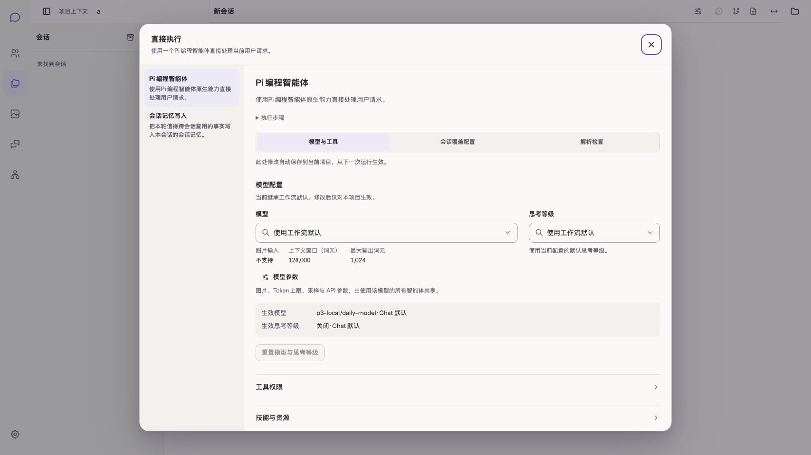
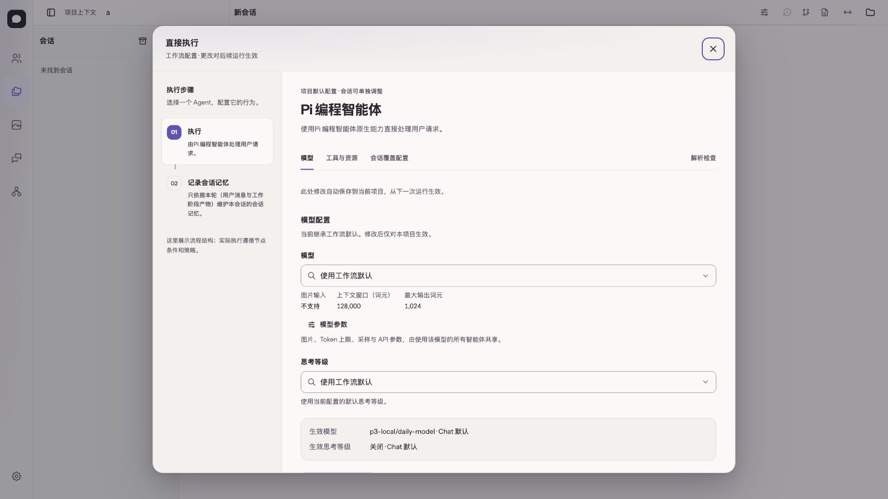
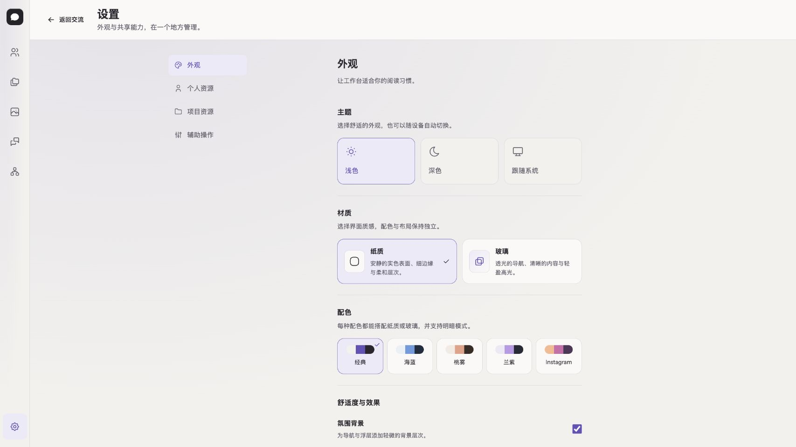

# 工作流配置与全局外观：实施及规范修订

日期：2026-09-30；状态：本轮实施与隔离验证完成，等待视觉评审。遵循[前端设计方法](../frontend-design-method.md)。

## 任务、信息与关系

任务：从项目会话或助手 Home 的设置入口，识别工作流中的执行者，调整后续执行配置，并知道保存影响哪里。关闭编辑后回到原会话/身份表单。

完整信息清单与关系推导见方法文档 §3。这里记录实际生产映射，避免另抄一份分析。原实现左侧只列 Agent，次序藏在详情文本；模型、工具、检查和会话范围混在大分组中；助手默认选择出现错误的 Session 文案。

| 关系 | 本轮表达 | 生产承载 |
| --- | --- | --- |
| Workflow 包含有序节点 | 编号列表，Agent 可配置，Task 只读 | `WorkflowAgentConfigDialog` 消费 summary.nodes，不硬编码节点个数 |
| Agent 有多类可调属性 | 模型、工具与资源、会话/默认选择 | 同一编辑器，既有配置 API 与 props，保留 Inspector 只读分类 |
| 继承与实际值 | 选项 + effective 值和来源 | 原 ModelConfigSection、Backend inspection |
| 模型定义属于全局 | 明确影响范围的模型参数入口 | 原 ModelsConfig 嵌套 Dialog，不新增单节点生成参数 |
| 高级文件装配低频 | 折叠到配置文件区 | `primary/append/promptFiles` 合同保留 |
| 外观轴独立 | 设置中分别选择明暗、材质、配色、效果 | useTheme + AppearanceSettings；不进 Workflow 请求 |

## 参考与实现决定

采用 Material 列表—详情布局来表达包含关系；Apple 的层级、对齐和控件/内容材质区分用于可读性；本地两项 Skills 用于键盘、请求生命周期、Token 与组件一致性检查。外部来源及适配边界见方法文档 §4。

默认品牌采用高对比墨色标记，当前对象标题提高字重；组内间距小于组间；选中编号和下划线表达位置。全局提供纸质/玻璃、经典/海蓝/桃雾/兰紫/Instagram；组合不改变表单信息和业务动作。兰紫深色借鉴 Dracula 的深底紫调，不复制其品牌或代码语法主题。既有七套原型仍作为历史探索保存。

## 首轮修订

1. **真实合同修正原型**：没有单节点采样公共合同，因此模型参数继续进入共享模型定义。会话/默认选择暂保留明确范围名，不伪装成已经支持完整“指令与输出”编辑。
2. **主题分类修正原型**：原型七套将模式、材质、配色绑定；生产改成独立轴。预设未来只作为组合快捷方式。
3. **流程结构与执行结果分开**：节点编号表达定义顺序，不使用完成色/状态勾选，不代表记忆节点每次必执行。
4. **文案是合同的一部分**：助手默认选择保存到 Home，不能继续说只影响当前会话。
5. **长目录不能只靠折叠**：真实内置规则/经验超过一个首屏，补搜索、已选优先和有限滚动区；高级路径仍可访问。不是让所有资源隐藏到“更多”。
6. **透明不应穿透正文**：实看玻璃深色后，发现背景聊天字形透到表单；正文恢复实色，只在导航/浮层外壳表达玻璃。浅色弱文字经自动对比度测试调深，不能用透明和低对比冒充精致。
7. **动画和静止布局分别验收**：窗口宽度改变后，React 响应式状态和 Dock 过渡尚未完成，原输入框几何用例偶发失败。补充绘制/过渡等待，保留完整视口断言；不以此宣称动效逐帧无问题。见[回归案例](../../../docs/development/experiences/responsive-layout-readiness.md)。

## 第二轮修订（2026-10-01，按设计样板对齐）

用户审定 `docs/design-previews/workflow-settings/` 样板后明确：整体按样板实施，7 套主题与布局细节都要，几乎一样。据此产生两条覆盖与一条延续：

1. **覆盖首轮修订 2（主题独立轴 → 7 套预设）**：外观系统改为 7 套绑定预设（paper/glacier/peach/instagram/graphite/obsidian/dracula，4 浅 3 深，明暗随预设），偏好键升 `chat:appearance:v2` 并确定性迁移 v1。实现与验收记录见[七套预设设计文档](./appearance-seven-presets.md)。首轮修订 6 的边界保留：正文实色、玻璃只用于导航/浮层外壳。
2. **解除首轮修订 1（单节点采样参数以真实合同落地）**：后端新增 `generation` 合同（temperature 0–2 / topP 0–1 / maxOutputTokens 1–32000）并透传 Pi 运行时；`AgentConfigSelection` 支持会话级 model/thinkingLevel/generation 覆盖（最具体，最后应用），durable 配置与 model-config API 同步扩展。模型参数由此从"只能进共享模型定义"变为节点可配的真实合同，不再伪装。
3. **配置页按样板重构**：三标签（模型与生成/指令与输出/工具与资源）+ 范围三档（当前会话/助手默认/项目默认）+ 底部摘要条，样式对齐样板；共享模型定义入口与模型目录继续由全局模型设置承载。实施与验收记录见[工作流设置对齐文档](./workflow-settings-sample-alignment-notes.md)。

## 验收记录

验证在独立 checkout 与隔离 `CHAT_HOME` 运行，使用本地假模型。未覆盖正式实例的 `.output` / `frontend/dist`，未写正式项目配置。

| 验证 | 结果与范围 |
| --- | --- |
| `pnpm verify` 前序阶段 | 架构检查；工具 58、Backend 695、Frontend 282、构建产物 31 项通过；类型检查、Frontend/Nitro/CLI 构建通过 |
| `pnpm verify` 开发链阶段 | 首次 9 通过、1 失败、2 条件跳过；失败为尺寸变化后的几何测量竞态，见修订 7，不记为全套通过 |
| 修复后 `pnpm test:dev` | 10 通过、0 失败、2 条件跳过，退出码 0；包括原失败用例和真实 Workflow/Pi 开发链。前序已通过阶段未重复执行，不将分段重跑写成单次 `pnpm verify` 全绿 |
| 配置真实浏览器 | 项目及助手入口、保存与刷新、共享模型嵌套编辑、父草稿保留、能力更新；390/768/1440px；2 材质 × 5 配色 × 2 明暗 = 20 组合及偏好刷新 |
| 外观单元回归 | 非法/旧版偏好、存储拒绝、独立字段恢复；10 套明暗配色的文字/主按钮对比度 |
| 人工真实页面 | 直接执行 2 节点、规划执行 4 节点含只读审核；方向键、Escape 与焦点返回；资源搜索无结果与恢复；跨标签外观同步且保留草稿；减少透明/动效开关 |
| 差异检查 | 根仓库与 Frontend `git diff --check` 通过 |

付费真实模型未启用；Nano 联合渠道验收因隔离 checkout 未安装 Nano 依赖而跳过。上述结果不代表这两条外部链路已验收，也不代表所有旧页面的玻璃/调色组合已人工检查。

### 同状态前后对照

以下均为真实页面：1707×960、中文、浅色、直接执行、同一隔离项目 a。旧版为 Frontend `3e6cceb3`，新版为本次工作区实现。模型、项目均为测试数据。截图随文档保存，避免仅依赖临时预览。

**之前：** 流程次序在折叠文本中，模型与工具混在长表。

**之后：** 节点次序可见，属性分类稳定，保存范围和生效事实就近说明。

**全局外观：** 明暗、材质、配色和效果分别选择，组合不改变配置草稿。

更多浏览器证据保存在根仓库本地 `.data/verification/frontend-design-rollout/`，不纳入运行数据。需要重新采集时，在隔离 checkout 执行 `CHAT_UI_EVIDENCE_DIR=/absolute/evidence/path pnpm test:built`；输入区响应式回归由 `pnpm test:dev` 执行。

## 下一批

先验证本编辑器在项目与助手两个入口的效果，再分析助手身份设置；之后分析 Chat 顶栏/输入/过程。全局颜色覆盖不等于这些页面的流程已经重做或人工全量验收。

## Phase C 验收数字（2026-10-01，配置对话框三标签重构）

- `pnpm typecheck` 0 错误；`pnpm test` 295 通过 / 0 失败（基线 292 + 新增 3）；`git diff --check` 干净（frontend 与父仓库）。
- 新增自动化门禁：generation 经 `parseAgentConfigSelection` 往返与越界拒绝；durable generation 的 PUT 请求体（设置与 `"generation":null` 清除）；三档互不覆盖的源码断言。
- i18n 守卫处理：`Temperature`/`Top-P` 标签入 i18n 键，单位后缀 `tokens` 加入既有"计量单位"允许清单。
- 详细记录见 `./workflow-settings-sample-alignment-notes.md`。
